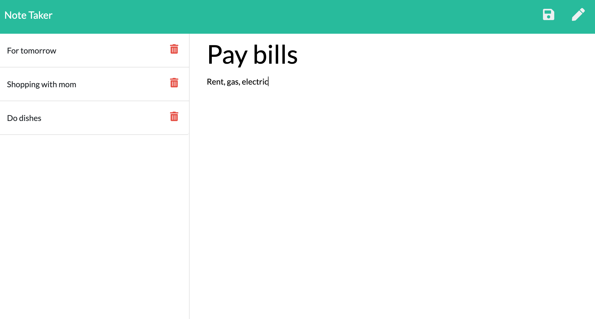
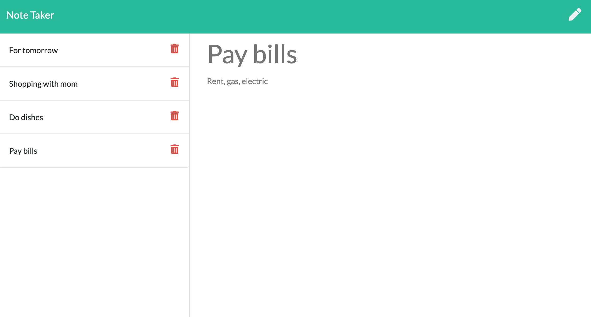

# My-Note-Taker

## Objective
Your assignment is to modify starter code to create an application called Note Taker that can be used to write and save notes. This application will use an Express.js back end and will save and retrieve note data from a JSON file.

## User Story
AS A small business owner
I WANT to be able to write and save notes
SO THAT I can organize my thoughts and keep track of tasks I need to complete

## Technologies Used
* Node js
* Express
* path

## Project Screenshots

Picture of notes page with working edit and delete icons

## Contact
* https://github.com/srad25
* https://github.com/srad25/My-Note-Taker
